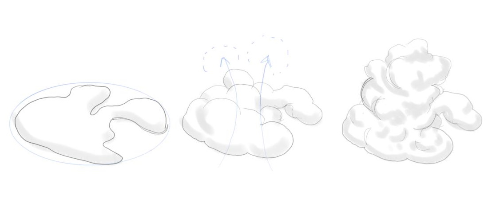

# Clouds

This is a ThreeJS experiment which eventually found a home on my [personal website](https://gfor.rest). I've created a simple algorithm to construct realistic, diverse cumulonimbus cloud formations in a voxel field, and render them with marching cubes. The cloud meshes are generated on a worker thread, then copied back to the main thread and loaded into a ThreeJS buffer geometry. I'm also using the excellent [react-three-fiber](https://github.com/react-spring/react-three-fiber) library to bind React to ThreeJS.

## The Algorithm

The algorithm to "inflate" the clouds is in [`src/cloudInflator.ts`](src/cloudInflator.ts). It works in stages:

1. Draw a 2d Perlin noise slice near the 'floor' of the voxel field, masked to a circle
2. In passes, iterate over each voxel and 'inflate' it based on certain criteria:
   1. If the voxel is empty, don't inflate it
   2. Inflation scales proportionally to how close the voxel is to the center of the voxel field

"Inflation" is accomplished by adding the values of a sphere centered on the target voxel, with a radius determined by the inflation 'score' of that particular voxel according to the rules above.

Although not precisely accurate to actual meteorological processes, this serves as a pretty good approximation of how rising air inflates the shape of a real cumulonimbus cloud. It results in a puffy, voluminous center with smaller formations on the boundaries of the circle.

To complete the illusion, the whole structure is rotated and scaled randomly to avoid the appearance of being locked to a grid.

## License

MIT. Feel free to use the algorithm, including the exact code, however you like! Credit is appreciated. Make beautiful clouds.

## Developing

This project was bootstrapped with [Create React App](https://github.com/facebook/create-react-app).

## Available Scripts

In the project directory, you can run:

### `npm start`

Runs the app in the development mode. 
Open [http://localhost:3000](http://localhost:3000) to view it in the browser.

The page will reload if you make edits. 
You will also see any lint errors in the console.

### `npm test`

Launches the test runner in the interactive watch mode. 
See the section about [running tests](https://facebook.github.io/create-react-app/docs/running-tests) for more information.

### `npm run build`

Builds the app for production to the `build` folder. 
It correctly bundles React in production mode and optimizes the build for the best performance.

The build is minified and the filenames include the hashes. 
Your app is ready to be deployed!

See the section about [deployment](https://facebook.github.io/create-react-app/docs/deployment) for more information.

### `npm run eject`

**Note: this is a one-way operation. Once you `eject`, you can’t go back!**

If you aren’t satisfied with the build tool and configuration choices, you can `eject` at any time. This command will remove the single build dependency from your project.

Instead, it will copy all the configuration files and the transitive dependencies (Webpack, Babel, ESLint, etc) right into your project so you have full control over them. All of the commands except `eject` will still work, but they will point to the copied scripts so you can tweak them. At this point you’re on your own.

You don’t have to ever use `eject`. The curated feature set is suitable for small and middle deployments, and you shouldn’t feel obligated to use this feature. However we understand that this tool wouldn’t be useful if you couldn’t customize it when you are ready for it.

## Learn More

You can learn more in the [Create React App documentation](https://facebook.github.io/create-react-app/docs/getting-started).

To learn React, check out the [React documentation](https://reactjs.org/).
